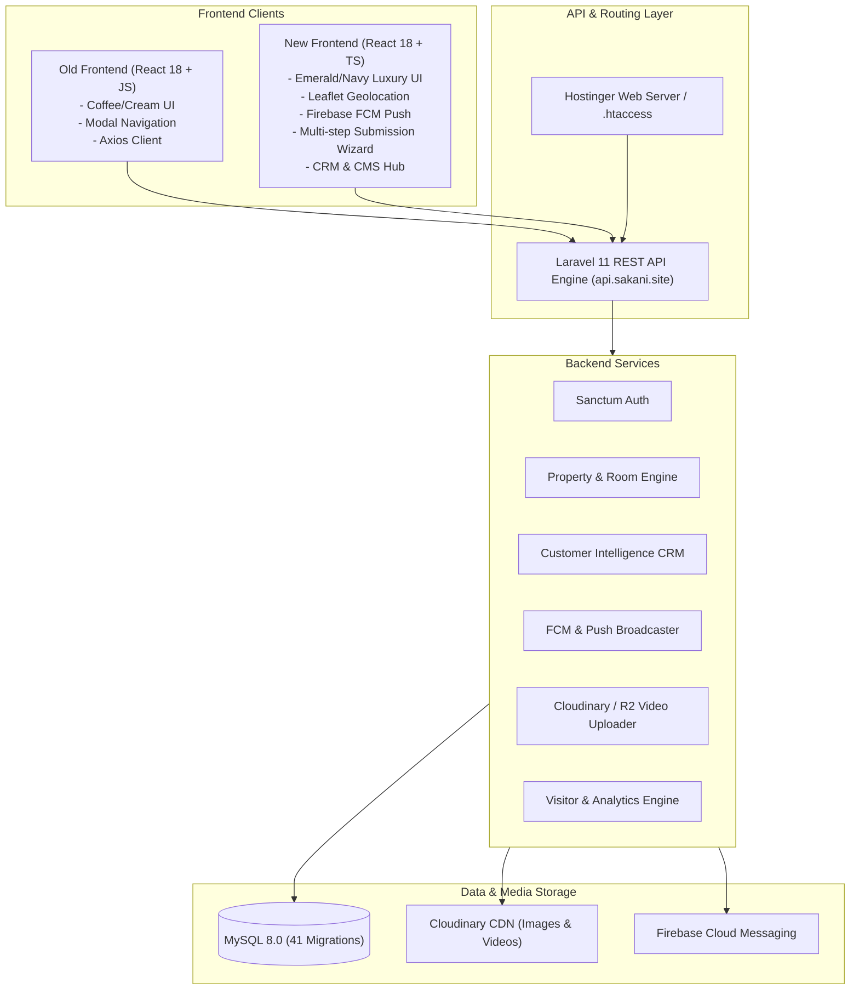
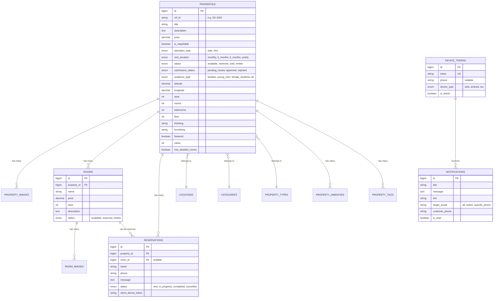

# 🏢 Sakani Platform — Complete System Architecture & Design Documentation
## (Old Design vs. New Design Comprehensive Guide)

---

## 📑 Table of Contents
1. [Executive Summary & System Overview](#1-executive-summary--system-overview)
2. [High-Level Architecture Comparison](#2-high-level-architecture-comparison)
3. [Old Design System & Frontend Architecture (`frontend`)](#3-old-design-system--frontend-architecture-frontend)
4. [New Design System & Modern Frontend (`frontend-new`)](#4-new-design-system--modern-frontend-frontend-new)
5. [Key Feature Differences & Improvements](#5-key-feature-differences--improvements)
6. [Backend System Architecture (`backend` - Laravel 11)](#6-backend-system-architecture-backend---laravel-11)
7. [Database Schema & Data Model Evolution](#7-database-schema--data-model-evolution)
8. [API Reference & Endpoint Directory](#8-api-reference--endpoint-directory)
9. [DevOps, CI/CD & Deployment Infrastructure](#9-devops-cicd--deployment-infrastructure)
10. [Migration & Operational Guide](#10-migration--operational-guide)

---

## 1. Executive Summary & System Overview

**Sakani (سكني)** is a real estate and housing platform operating in New Damietta (دمياط الجديدة) and neighboring coastal / urban zones. The platform caters to:
- **Property Buyers & Tenants**: Searching for apartments, villas, duplexes, shops, land, studios, and student housing.
- **University Students & Singles**: Room-by-room rental management with specialized specifications (female students, male students, furnished single rooms).
- **Property Owners & Brokers**: Direct public submission of listings, pricing, and media for admin moderation.
- **Platform Administrators**: Complete control over listing approvals, real-time CRM customer scoring, room management, push notifications (FCM), marketing campaigns, visitor analytics, and live website CMS customization.

---

## 2. High-Level Architecture Comparison



---

## 3. Old Design System & Frontend Architecture (`frontend`)

### 3.1 Tech Stack
- **Framework**: React 18 (JavaScript / JSX)
- **Bundler**: Vite
- **Styling**: Tailwind CSS (custom utility classes)
- **Networking**: Axios (`axios.create`)
- **State Handling**: Local component states (`useState`), direct localStorage reads for favorites, manual caching helper (`cache.js`).

### 3.2 Visual & UX Characteristics
- **Color Palette**: Warm "Coffee & Cream" aesthetic:
  - Gold Accent: `#C8A97E`
  - Cream Background: `#FDFBF7` / `#F5EFE6`
  - Dark Charcoal: `#1A1A1A`
- **Navigation Paradigm**: Heavy reliance on popups and modals (`PropertyModal`, `ReservationModal`, `FavoritesDrawer`).
- **Route Layout**:
  - `/` (Home page with hero slider, featured properties, location highlights)
  - `/buy` (Filtered properties for sale)
  - `/rent` (Filtered properties for rent)
  - `/rent/:location` (Location-specific rental listing)
  - `/need` (Customer demand request form)
  - `/sell` (Basic contact form for owners)
  - `/contact` (General inquiry form)
  - `/admin-login` (Admin Sanctum authentication)
  - `/dashboard/*` (Tabular admin dashboard for properties, categories, locations, reservations, messages, tags, settings)

### 3.3 Limitations of Old Design
- ❌ No TypeScript typing — higher risk of runtime object key mismatch.
- ❌ No interactive map location picker (only static location dropdowns).
- ❌ No multi-room detailed rental breakdown in the public UI.
- ❌ No customer intelligence or automated lead scoring.
- ❌ No live web push notifications (FCM) or client reservation tracking.
- ❌ No dynamic frontend CMS management (Hero video/image was static).
- ❌ Rigid property submission form with no multi-step wizard or review staging.

---

## 4. New Design System & Modern Frontend (`frontend-new`)

### 4.1 Tech Stack
- **Framework**: React 18 / 19 with **100% Strict TypeScript (`TSX`)**
- **Bundler / Tooling**: Vite & Bun support
- **Styling**: Modern Luxury Real Estate Design System with Tailwind CSS, custom animations, glassmorphism, responsive grid layouts
- **Maps & Geolocation**: Leaflet & OpenStreetMap (`LocationMapPicker.tsx`, `PropertyLocationMap.tsx`)
- **Push Notifications**: Firebase Web Push SDK & Service Worker (`firebaseService.ts`, `NotificationCenter.tsx`)
- **Icons**: Lucide React
- **Data Resilience**: Dual data layer (`ApiService.ts` live REST API + `StorageService.ts` offline-first fallback with automatic synchronization)

### 4.2 Modern Design System Tokens & Aesthetics
- **Color Palette**: Modern Luxury Navy & Emerald:
  - **Primary Navy / Slate**: `#0F172A` (Slate 900), `#1E293B` (Slate 800)
  - **Emerald Accent**: `#10B981` (Emerald 500), `#059669` (Emerald 600)
  - **Warm Amber / Gold**: `#F59E0B` (Amber 500)
  - **Surface & Cards**: Pure white `#FFFFFF` with refined drop shadows (`shadow-sm`, `shadow-xl`) and subtle border radii (`rounded-2xl`, `rounded-3xl`).
- **Mobile First / PWA Experience**:
  - Sticky interactive Bottom Navigation bar (`BottomNav.tsx`) with active badges for favorites and reservations.
  - Skeleton screens (`Skeletons.tsx`) for zero-layout-shift loading.
  - Branded animated loader (`SakaniBrandedLoader.tsx`).
  - Floating WhatsApp helper with pre-filled property inquiries.

### 4.3 Frontend Component & Page Hierarchy (`frontend-new`)

```
frontend-new/src/
├── App.tsx                     # Main Router, Central State & API Synchronization
├── types/
│   └── index.ts                # TypeScript Models & Filter Interfaces
├── services/
│   ├── apiService.ts           # Centralized Laravel REST API Client
│   ├── storageService.ts       # LocalStorage fallback & phone normalizer
│   ├── firebaseService.ts      # FCM Web Push Service Worker handler
│   └── cloudinaryService.ts    # Direct Cloudinary media integration
├── layouts/
│   ├── PublicLayout.tsx        # Header, Footer, BottomNav, Floating WhatsApp
│   └── AdminLayout.tsx         # Sidebar, Admin Header, Push Notifications Trigger
├── pages/
│   ├── Home.tsx                # Dynamic Hero (Video/Img), Search Bar, Featured Showcase,
│   │                           # District Cards, Why Us, Student Housing Highlight
│   ├── ListingPage.tsx         # Multi-criteria Filter Bar, Grid/List view, Sort, Map view
│   ├── PropertyDetailsPage.tsx # Gallery, Video Player, Leaflet Map, Specs, Rooms, Inquiries
│   ├── AddPropertyPage.tsx     # Public Multi-step Property Submission Wizard
│   ├── NeedPropertyPage.tsx    # Customer Demand / Request Form
│   ├── MyReservationsPage.tsx  # Customer Self-service Reservations Tracking
│   ├── AboutContact.tsx        # About & Contact form with interactive map
│   ├── AdminLoginPage.tsx      # Secure Admin Authentication
│   └── admin/                  # 17 Modular Admin Dashboard Pages
│       ├── AdminDashboardPage.tsx
│       ├── AdminPropertiesPage.tsx
│       ├── AdminPropertySubmissionsPage.tsx (Review & Approve/Reject)
│       ├── AdminCustomersPage.tsx (Customer Intelligence CRM)
│       ├── AdminReservationsPage.tsx
│       ├── AdminNeedRequestsPage.tsx
│       ├── AdminMarketingMailPage.tsx
│       ├── AdminNotificationsPage.tsx (Push Broadcast Center)
│       ├── AdminWebsiteContentPage.tsx (Hero CMS, Why Us, Announcements)
│       ├── AdminLocationsPage.tsx
│       ├── AdminCategoriesPage.tsx
│       ├── AdminTagsPage.tsx
│       ├── AdminAmenitiesPage.tsx
│       ├── AdminStatisticsPage.tsx
│       └── AdminSettingsPage.tsx
└── components/
    ├── Header.tsx              # Responsive Nav, Notification Bell, Favorites Trigger
    ├── Footer.tsx              # Brand story, quick links, contact info, social links
    ├── BottomNav.tsx           # Mobile dock navigation
    ├── PropertyCard.tsx        # High-conversion property card with tags & badges
    ├── PropertyFormWizard.tsx  # 4-step wizard for property creation
    ├── LocationMapPicker.tsx   # Interactive Leaflet map coordinate picker
    ├── NotificationCenter.tsx  # Live push & in-app notification drawer
    └── AdminRoomManagementModal.tsx # Room-by-room editor for student housing
```

---

## 5. Key Feature Differences & Improvements

| Feature Dimension | Old System (`frontend`) | New System (`frontend-new`) |
| :--- | :--- | :--- |
| **Language & Typing** | JavaScript (`.jsx`) | **100% Strict TypeScript (`.tsx`, `.ts`)** |
| **Theme & UI** | Coffee/Cream warm retro palette | **Luxury Navy & Emerald modern real estate UI** |
| **Mobile UX** | Standard desktop navbar on mobile | **Dedicated Mobile Bottom Navigation dock** |
| **Map & Coordinates** | Text/Dropdown district selector | **Interactive Leaflet Map with GPS coordinate picking** |
| **Property Submission** | Basic single-step contact form | **4-Step Interactive Wizard with Admin Approval Queue** |
| **Student & Room Housing** | Basic property description notes | **Detailed Room Sub-listings with separate pricing & images** |
| **Customer Intelligence CRM** | Simple contact message list | **Customer scoring (VIP/Active), interaction timeline & matching** |
| **Push Notifications** | None | **Firebase Cloud Messaging (FCM) web push + Admin Broadcast** |
| **My Reservations** | None (Admin only view) | **Customer Self-Service status tracker (`/my-reservations`)** |
| **Website Content CMS** | Hardcoded in template | **Live Admin CMS for Hero video/images, banner & why-us cards** |
| **Marketing Email Studio** | Basic text sender | **Visual newsletter generator with live HTML responsive preview** |
| **Data Resilience** | Direct API failure causes crash | **Dual Layer (REST API + Offline LocalStorage sync fallback)** |

---

## 6. Backend System Architecture (`backend` - Laravel 11)

### 6.1 Core Framework & Packages
- **Framework**: Laravel 11 (PHP 8.2+)
- **Authentication**: Laravel Sanctum (`auth:sanctum` middleware)
- **Database**: MySQL 8.0 with InnoDB engine
- **Media Processing**: Cloudinary PHP SDK + Cloudflare R2 + Enhanced Chunked Video Upload Controller
- **Push Notifications**: Firebase Admin SDK integration (`FirebaseNotificationService.php`)

### 6.2 Backend Controller Directory (`app/Http/Controllers/Api`)
1. [`PropertyController.php`](file:///home/abdo/projects/sakani/backend/app/Http/Controllers/Api/PropertyController.php): CRUD, top-viewed, featured properties, related listings, view counters, filters.
2. [`PropertySubmissionController.php`](file:///home/abdo/projects/sakani/backend/app/Http/Controllers/Api/PropertySubmissionController.php): Handles public property submissions and admin approval/rejection workflows.
3. [`CustomerIntelligenceController.php`](file:///home/abdo/projects/sakani/backend/app/Http/Controllers/Api/CustomerIntelligenceController.php): Aggregates customer data across inquiries, scoring tiers (Gold VIP, Blue Active, Slate Normal), and matches listings with client requests.
4. [`NotificationController.php`](file:///home/abdo/projects/sakani/backend/app/Http/Controllers/Api/NotificationController.php): Device token registration, FCM push dispatches, and manual admin broadcasting.
5. [`RoomController.php`](file:///home/abdo/projects/sakani/backend/app/Http/Controllers/Api/RoomController.php): Room-level sub-entities for student housing properties.
6. [`ReservationController.php`](file:///home/abdo/projects/sakani/backend/app/Http/Controllers/Api/ReservationController.php): Reservation bookings, customer lookup by device token/phone, and status management.
7. [`EnhancedVideoUploadController.php`](file:///home/abdo/projects/sakani/backend/app/Http/Controllers/Api/EnhancedVideoUploadController.php): Chunked upload handling for 4K video walkthroughs.
8. [`MarketingMailController.php`](file:///home/abdo/projects/sakani/backend/app/Http/Controllers/Api/MarketingMailController.php): Email broadcasting and live preview template renderer.
9. [`DashboardController.php`](file:///home/abdo/projects/sakani/backend/app/Http/Controllers/Api/DashboardController.php) & [`StatisticsController.php`](file:///home/abdo/projects/sakani/backend/app/Http/Controllers/Api/StatisticsController.php): Aggregated business intelligence, visitor tracking, and charts.
10. [`LocationController.php`](file:///home/abdo/projects/sakani/backend/app/Http/Controllers/Api/LocationController.php), [`CategoryController.php`](file:///home/abdo/projects/sakani/backend/app/Http/Controllers/Api/CategoryController.php), [`AmenityController.php`](file:///home/abdo/projects/sakani/backend/app/Http/Controllers/Api/AmenityController.php), [`TagController.php`](file:///home/abdo/projects/sakani/backend/app/Http/Controllers/Api/TagController.php), [`PropertyTypeController.php`](file:///home/abdo/projects/sakani/backend/app/Http/Controllers/PropertyTypeController.php), [`SettingController.php`](file:///home/abdo/projects/sakani/backend/app/Http/Controllers/Api/SettingController.php).

---

## 7. Database Schema & Data Model Evolution

The system includes **41 database migrations**. Below is the Entity-Relationship breakdown:



---

## 8. API Reference & Endpoint Directory

### 8.1 Public API Endpoints
| HTTP Verb | Endpoint | Purpose |
| :--- | :--- | :--- |
| `GET` | `/api/health` | System health check and server status |
| `GET` | `/api/config` | Public system settings and feature flags |
| `POST` | `/api/login` | Admin login and Sanctum token generation |
| `GET` | `/api/properties` | Search & filter property listings |
| `GET` | `/api/properties/best` | Retrieve featured properties |
| `GET` | `/api/properties/top-viewed` | Retrieve top-viewed listings |
| `GET` | `/api/properties/{id}` | Single property details with rooms, amenities & images |
| `POST` | `/api/properties/{id}/view` | Increment property view count |
| `POST` | `/api/properties/submit` | Public user property submission for admin review |
| `POST` | `/api/reservations` | Create property or room inquiry / reservation |
| `POST` | `/api/reservations/check` | Check reservation status by property & phone |
| `GET` | `/api/customer/reservations` | List customer reservations by phone or device token |
| `POST` | `/api/need-requests` | Submit customer property need / request |
| `POST` | `/api/contact-messages` | Submit contact us inquiry |
| `POST` | `/api/device-tokens` | Register FCM web push token |
| `GET` | `/api/customer/notifications` | Fetch customer push notifications |
| `GET` | `/api/locations`, `/categories`, `/amenities`, `/tags` | Lookup lists for filters |

### 8.2 Protected Admin API Endpoints (`auth:sanctum` + `admin` middleware)
| HTTP Verb | Endpoint | Purpose |
| :--- | :--- | :--- |
| `POST` | `/api/properties` | Create new property listing |
| `PUT` | `/api/properties/{id}` | Update existing property listing |
| `DELETE` | `/api/properties/{id}` | Delete property listing |
| `GET` | `/api/property-submissions` | List submitted properties awaiting review |
| `POST` | `/api/property-submissions/{id}/approve` | Approve submitted property |
| `POST` | `/api/property-submissions/{id}/reject` | Reject submitted property with feedback |
| `POST` | `/api/properties/{id}/rooms` | Create detailed room under property |
| `PUT` | `/api/rooms/{id}` | Update detailed room |
| `DELETE` | `/api/rooms/{id}` | Delete detailed room |
| `GET` | `/api/customers` | Customer Intelligence CRM list with scoring tiers |
| `GET` | `/api/customers/{phone}` | Full customer interaction history & CRM profile |
| `POST` | `/api/customers/recommend-properties` | Send smart property recommendations to clients |
| `GET` | `/api/customers/match-properties/{needId}` | Auto-match properties with need request |
| `POST` | `/api/admin/notifications/send-manual` | Broadcast manual push notification via FCM |
| `POST` | `/api/marketing/send` | Send marketing newsletter campaign |
| `POST` | `/api/marketing/preview` | Live HTML preview for marketing emails |
| `GET` | `/api/dashboard` | Main admin analytics, counts & quick metrics |
| `GET` | `/api/statistics` | Detailed visitor, page view & reservation metrics |
| `POST` | `/api/settings` | Save dynamic CMS content & platform settings |

---

## 9. DevOps, CI/CD & Deployment Infrastructure

### 9.1 Automatic GitHub Actions Pipeline (`.github/workflows/deploy.yml`)
- **Trigger**: Every push to `main` branch.
- **Workflow Steps**:
  1. **Checkout Code**: Clones repository in GitHub runner.
  2. **Build Frontend**: Installs npm dependencies and runs `npm run build`.
  3. **SCP Deployment**: Securely transfers backend and frontend dist bundles to Hostinger.
  4. **Post-Deploy Laravel Commands**:
     ```bash
     composer install --no-dev --optimize-autoloader
     php artisan migrate --force
     php artisan config:cache
     php artisan route:cache
     php artisan view:cache
     ```
  5. **Health Verification**: Curls `https://api.sakani.site/api/health` to confirm successful deployment.

### 9.2 Domain & Server Routing Map
| Domain | Server Path | Role |
| :--- | :--- | :--- |
| `sakani.site` | `/public_html/` | React Single Page Application (Frontend) |
| `api.sakani.site` | `/public_html/backend/public` | Laravel REST API Engine |

---

## 10. Migration & Operational Guide

### 10.1 Running the New Frontend
```bash
# Navigate to new frontend directory
cd frontend-new

# Install dependencies (Node 18+ or Bun)
npm install

# Configure environment in .env
VITE_API_URL=http://localhost:8000/api
# Or leave empty for auto-detection

# Run local development server
npm run dev
```

### 10.2 Switching Production Frontend to `frontend-new`
When ready to switch the default frontend build to `frontend-new`:
1. In `.github/workflows/deploy.yml`, update the frontend build directory from `frontend` to `frontend-new`.
2. Push to `main` to trigger the automated CI/CD deployment.
